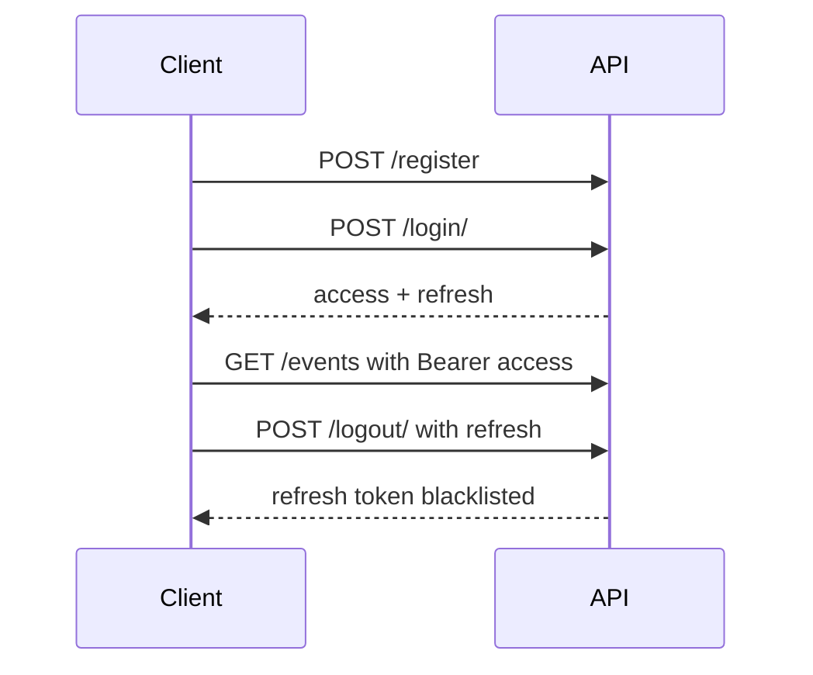

# API Documentation

## Base URL

`http://127.0.0.1:8000`

## Authentication

The API uses JWT authentication through `djangorestframework-simplejwt`.

- Auth header: `Authorization: Bearer <access_token>`
- Access token lifetime: 30 minutes
- Refresh token lifetime: 7 days
- Login identifier: `email` (custom user model)

Auth is required for protected endpoints. Public endpoints are marked below.



## Endpoints

### 1) Register User

- Method: `POST`
- Path: `/register`
- Auth: Public

Request body:

```json
{
  "name": "Jane Doe",
  "email": "jane@example.com",
  "password": "securepass123"
}
```

Success response:

- Status: `201 Created`
- Body shape:

```json
{
  "id": 1,
  "name": "Jane Doe",
  "email": "jane@example.com",
  "password": "securepass123",
  "created_at": "2026-06-16T10:00:00Z"
}
```

Note: the current serializer returns `password` in the response.

### 2) Login

- Method: `POST`
- Path: `/login/`
- Auth: Public

Request body:

```json
{
  "email": "jane@example.com",
  "password": "securepass123"
}
```

Success response:

- Status: `200 OK`

```json
{
  "access": "<jwt_access_token>",
  "refresh": "<jwt_refresh_token>"
}
```

### 4) Logout

- Method: `POST`
- Path: `/logout/`
- Auth: Required

Headers:

```http
Authorization: Bearer <access_token>
```

Request body:

```json
{
  "refresh": "<jwt_refresh_token>"
}
```

Success response:

- Status: `200 OK`

```json
{
  "message": "Logged out successfully"
}
```

### 5) List Events

- Method: `GET`
- Path: `/events`
- Auth: Required

Success response:

- Status: `200 OK`
- Body: array of event objects

```json
[
  {
    "id": 1,
    "title": "Tech Conference",
    "description": "Annual event",
    "date": "2026-07-01T09:00:00Z",
    "location": "Chennai",
    "created_at": "2026-06-16T10:30:00Z"
  }
]
```

### 6) Search Events

- Method: `GET`
- Path: `/search?search=<term>`
- Auth: Public

Example:

`/search?search=tech`

Success response:

- Status: `200 OK`
- Body: matching event array, or

```json
{
  "message": "no result found"
}
```

### 7) Event Details

- Method: `GET`
- Path: `/events/{id}`
- Auth: Required

Success response:

- Status: `200 OK`

```json
{
  "id": 1,
  "title": "Tech Conference",
  "description": "Annual event",
  "date": "2026-07-01T09:00:00Z",
  "location": "Chennai",
  "created_at": "2026-06-16T10:30:00Z",
  "is_registered": true
}
```

### 8) Register for Event

- Method: `POST`
- Path: `/events/{id}/register/`
- Auth: Required

Request body:

```json
{}
```

Responses:

- `201 Created`

```json
{
  "message": "Successfully registered"
}
```

- `409 Conflict`

```json
{
  "message": "Already registered for the event"
}
```

- `404 Not Found`

```json
{
  "error": "Event not found"
}
```

### 9) My Registrations

- Method: `GET`
- Path: `/my-registrations`
- Auth: Required

Success response:

- Status: `200 OK`
- Body: registration list with nested event objects

```json
[
  {
    "id": 5,
    "user": 1,
    "event": {
      "id": 1,
      "title": "Tech Conference",
      "description": "Annual event",
      "date": "2026-07-01T09:00:00Z",
      "location": "Chennai",
      "created_at": "2026-06-16T10:30:00Z"
    },
    "registered_at": "2026-06-16T11:00:00Z"
  }
]
```

### 10) Django Admin

- Path: `/admin/`
- Access: Staff/Superuser only

## UI to API Mapping

The UI wrapper functions are in `eventplatform-ui/src/services/api.js`.

| UI function | Method | Endpoint |
| --- | --- | --- |
| `createuser(data)` | POST | `/register` |
| `loginuser(data)` | POST | `/login/` |
| `logoutuser()` | POST | `/logout/` |
| `getallevents()` | GET | `/events` |
| `eventsearch(searchTerm)` | GET | `/search?search={term}` |
| `getevent(id)` | GET | `/events/{id}` |
| `eventregister(id)` | POST | `/events/{id}/register/` |
| `getregisterations()` | GET | `/my-registrations` |
